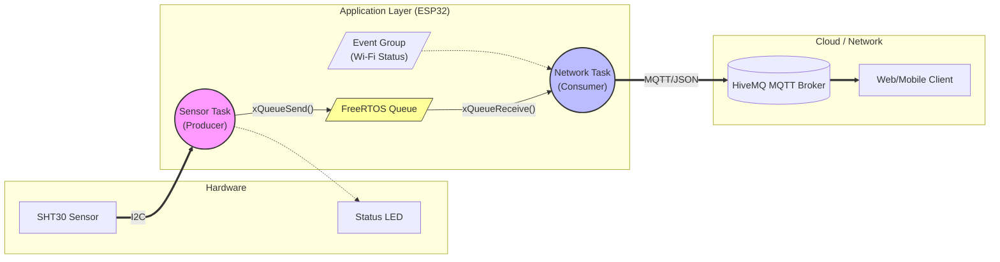
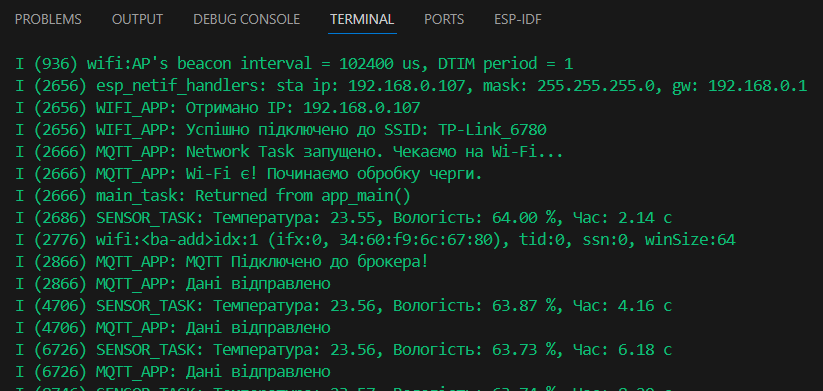
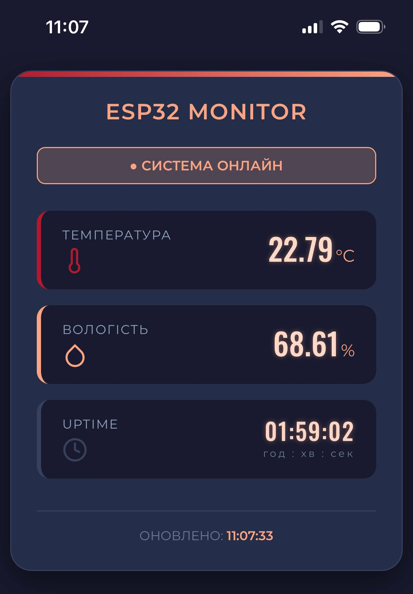

#  Industrial-Grade IoT Climate Monitor

> **Industrial-grade device for climate monitoring using the professional ESP-IDF framework.**
> The project combines low-level hardware interaction with high-level RTOS logic, implementing a non-blocking asynchronous architecture.

---

##  System Architecture & Data Flow

The system is built on a multi-threaded architecture using **FreeRTOS**. It separates data acquisition (Hard Real-Time) from network communication (Soft Real-Time) using Queues and Event Groups.

##  Functional Layers

The firmware is structured into logical layers to ensure maintainability and scalability:

### 1. Sensor Layer
* **Custom I2C Driver:** Implementation of raw I2C communication for the SHT30 sensor.
* **Features:** Command transmission, 6-byte data readout, and raw data parsing using bitwise operations (MSB/LSB concatenation).

### 2. Indication Layer
* **Non-blocking LED Control:** Uses hardware PWM (LEDC peripheral) instead of simple delays.
* **Statuses:** Visual feedback for system states (Connecting, Error, Working/Breathing).

### 3. Application Layer (RTOS)
* **Task Separation:** Decoupled data collection and data transmission logic.
* **Synchronization:** Robust use of FreeRTOS primitives (Tasks, Queues, Event Groups).

### 4. Network Layer
* **Connectivity:** Wi-Fi Station Mode with auto-reconnect logic.
* **Telemetry:** Formatting data into JSON and publishing to an MQTT Broker via TCP/IP.

##  Tech Stack (Hard Skills)

| Category | Technologies |
|----------|--------------|
| **Core** | C / C++ (Embedded), ESP-IDF SDK |
| **RTOS** | **FreeRTOS** (Tasks, Queues, Event Groups, Semaphores) |
| **Protocols** | I2C, UART, MQTT, HTTP/Wi-Fi |
| **Peripherals** | GPIO, Hardware Timers, LEDC (PWM) |
| **Tools** | Git, Serial Monitor, Logic Analyzer / Datasheet Analysis |

##  Hardware Setup

* **MCU:** ESP32-DEVKIT V1 (WROOM-32)
* **Sensor:** SHT30 (Temperature & Humidity)
* **Connection:**
    * `SDA` -> `GPIO 23`
    * `SCL` -> `GPIO 22`
    * `LED` -> `GPIO 2` (Built-in)

*(My physical setup on the breadboard)*

---

##  Screenshots

### System Logs (UART)
*Demonstration of the Producer-Consumer pattern and Queue handling:*

### MQTT Dashboard
*Real-time telemetry data received via Cloud:*

### Web Interface
*Responsive mobile dashboard for real-time sensor data visualization:*

##  Future Improvements

-  Implement CRC8 checksum verification for data integrity.
-  Add Deep Sleep mode for power saving.
-  Implement OTA (Over-the-Air) firmware updates.
-  Store history in NVS (Flash memory) when Wi-Fi is lost.

---

    <b>Created by Yevhen Bondarenko</b>

